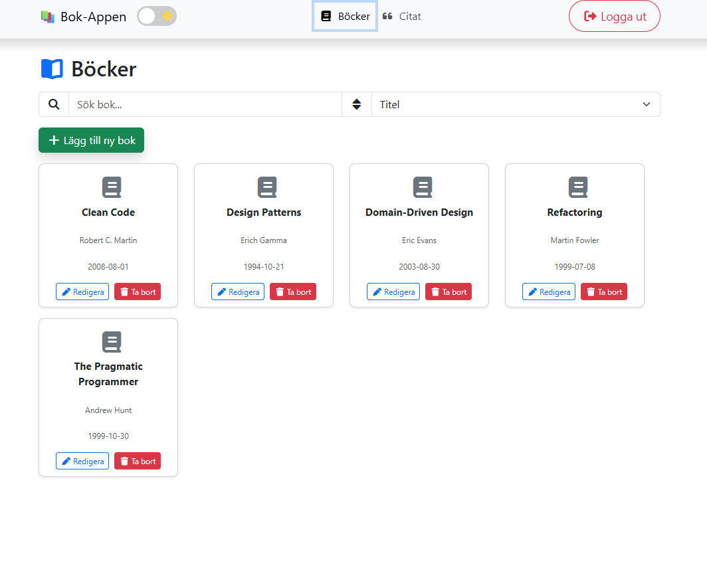
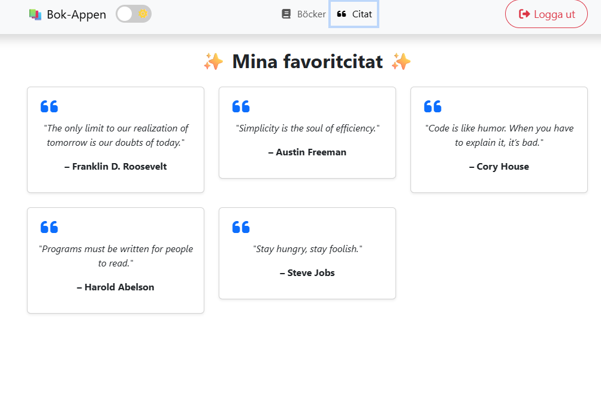

<h1 align="center">📚 Bok-appen</h1>

<p align="center">
En fullstack CRUD-applikation byggd med .NET 9 (Web API) och Angular 20.  
Användaren kan logga in, hantera en lista av böcker (lägga till, redigera, ta bort)  
och läsa en separat citatsida.
</p>

---

## ✨ Funktioner

- 🔑 JWT-login (enkelt användarkonto: admin / password)
- 📚 Bokhantering (CRUD)
  - Lägg till ny bok 
  - Redigera befintlig bok 
  - Ta bort bok 
  - Visa alla böcker i listan

- 💬 Citatsida med 5 favoritcitat (responsiv design med Bootstrap-kort) 
- 🌙 Light/Dark mode toggle 📱
-  Responsiv design (mobilvänlig navbar med hamburgermeny)

---

## 🛠️ Teknikstack

Frontend 
- Angular 20 
- Bootstrap 5 
- Font Awesome

Backend 
- ASP.NET Core 9 Web API 
- Entity Framework Core InMemory 
- JWT Authentication

Hosting 
- Backend: Render 
- Frontend: Render

---

## 🚀 Kom igång lokalt

Klona repo 
```
git clone https://github.com/Jojje84/Bookapp.git cd Bookapp
``` 

Backend (ASP.NET Core API) 
```
cd Backend 
dotnet restore 
dotnet run
``` 

API körs på: 
👉 https://localhost:5001/api/books

Frontend (Angular) 
```
cd Frontend 
npm install 
ng serve
``` 

Frontend körs på: 
👉 http://localhost:4200/

Standard-login 
```
admin: test 
password: 1234
``` 

---

## 📂 Projektstruktur


```
Bookapp/
│── Backend/ # .NET 9 Web API
│   ├── Controllers/
│   ├── Models/
│   ├── Data/
│   └── Program.cs
│
│── Frontend/ # Angular 20
│   ├── src/app/
│   │   ├── components/
│   │   │   ├── books/    # Bokhantering
│   │   │   ├── login/    # Login-sida
│   │   │   ├── navbar/   # Navbar-komponent
│   │   │   └── quotes/   # Citat-sida
│   │   └── services/     # BookService, AuthService
│   ├── angular.json
│   └── package.json
``` 

---

## 🌍 Deployment

**Backend:**  
🚀 Deployad på Render → [bookapp-backend-lgwi.onrender.com](https://bookapp-backend-lgwi.onrender.com)  

**Frontend:**  
🚀 Deployad på Render → [bookapp-frontend-mlbt.onrender.com](https://bookapp-frontend-mlbt.onrender.com)  

---

### 🔗 Koppling mellan frontend & backend
För att frontend ska prata med backend:  
Ändra `BookService` i Angular så att `baseUrl` pekar på din Render-URL.

---

## Backend API

🔗 [Swagger UI för backend](https://bookapp-backend-lgwi.onrender.com/swagger)

Här kan du testa alla endpoints (kräver JWT-token för skyddade anrop).

---

## 📸 Skärmbilder

- Login-sida

🔑 Enkel inloggning med JWT


- Böcker

📚 Lista böcker, redigera, ta bort, lägg till


- Citat-sida

💬 Visa 5 favoritcitat i ett responsivt grid


---

## ✅ Att göra / förbättringar

- Byta ut InMemory DB mot en riktig databas (t.ex. PostgreSQL på Render).
- Spara användare och böcker permanent.
- Lägga till registreringsfunktion.
- Fler visuella animationer på citat- och bokkort.