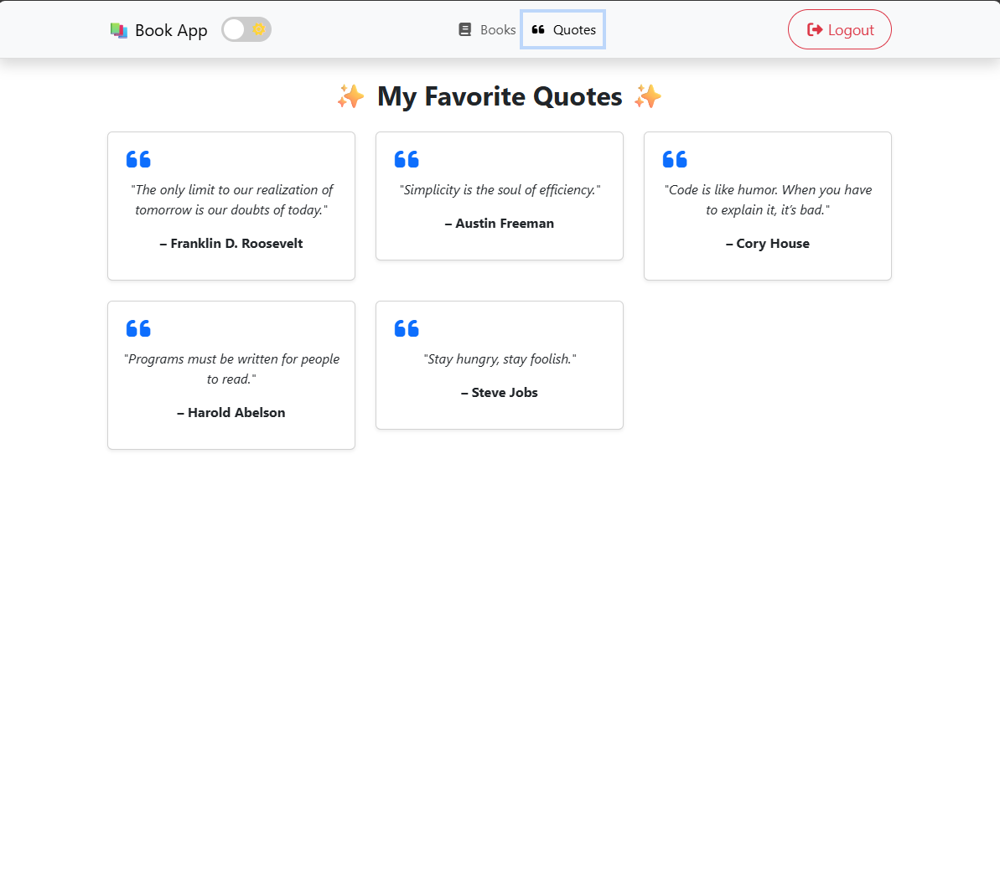

<h1 align="center">📚 Book App</h1>

<p align="center">
A fullstack CRUD application built with .NET 9 (Web API) and Angular 20.  
Users can log in, manage a list of books (add, edit, delete),  
and view a separate quotes page.
</p>

---

## ✨ Features

- 🔑 JWT login (default user: admin / password)  
- 📚 Book management (CRUD)  
  - Add new book  
  - Edit existing book  
  - Delete book  
  - View all books in the list  

- 💬 Quotes page with 5 favorite quotes (responsive design using Bootstrap cards)  
- 🌙 Light/Dark mode toggle 📱  
- 📱 Responsive design (mobile-friendly navbar with hamburger menu)  

---

## 🛠️ Tech Stack

**Frontend**  
- Angular 20  
- Bootstrap 5  
- Font Awesome  

**Backend**  
- ASP.NET Core 9 Web API  
- Entity Framework Core InMemory  
- JWT Authentication  

**Hosting**  
- Backend: Render  
- Frontend: Render  

---

## 🚀 Getting Started Locally

1. Clone the repository:  
```
git clone https://github.com/Jojje84/Bookapp.git cd Bookapp
``` 

2. Start the Backend (ASP.NET Core API):
```
cd Backend 
dotnet restore 
dotnet run
``` 

API runs at:
👉 https://localhost:5001/api/books

3. Start the Frontend (Angular):
```
cd Frontend 
npm install 
ng serve
``` 

Frontend runs at:
👉 http://localhost:4200/

4. Default login:
```
admin: test 
password: 1234
``` 

---

## 📂 Project Structure
```
Bookapp/
│── Backend/              # .NET 9 Web API
│   ├── Controllers/
│   ├── Models/
│   ├── Data/
│   └── Program.cs
│
│── Frontend/             # Angular 20
│   ├── src/app/
│   │   ├── components/
│   │   │   ├── books/    # Book management
│   │   │   ├── login/    # Login page
│   │   │   ├── navbar/   # Navbar component
│   │   │   └── quotes/   # Quotes page
│   │   └── services/     # BookService, AuthService
│   ├── angular.json
│   └── package.json
``` 

---

## 🌍 Deployment

**Backend:**  
🚀 Deployed on Render → [bookapp-backend-lgwi.onrender.com](https://bookapp-backend-lgwi.onrender.com)  

**Frontend:**  
🚀 Deployed on Render → [bookapp-frontend-mlbt.onrender.com](https://bookapp-frontend-mlbt.onrender.com)  

---

## 🔗 Connecting Frontend & Backend
To connect the Angular frontend with the backend:
Update BookService in Angular so that baseUrl points to your Render backend URL.

---

## Backend API

🔗 [Swagger UI för backend](https://bookapp-backend-lgwi.onrender.com/swagger)

Here you can test all endpoints (JWT token required for protected requests).

---

## 📸 Screenshots

- Login-

🔑 Simple login with JWT


- Books

📚 List books, edit, delete, add  


- Quotes Page

💬 Display 5 favorite quotes in a responsive grid


---

## ✅ To Do / Improvements

- Replace InMemory DB with a real database (e.g., PostgreSQL on Render).
- Persist users and books permanently.
- Add a user registration feature.
- Add more visual animations for quotes and book cards.

---

## 📄 License

This project is licensed under the MIT License. See the [LICENSE](LICENSE) file for details.

---

## Contact

👤 Jorge

[](https://github.com/Jojje84) 
&nbsp;
[](mailto:jorgeavilas@icloud.com) 
&nbsp;
[](https://www.linkedin.com/in/jorge-avila-35622030/)
